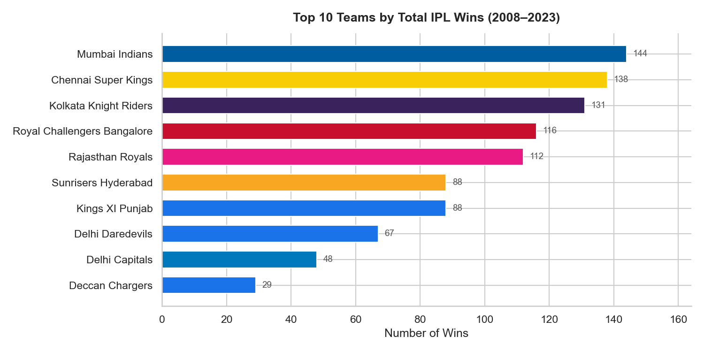
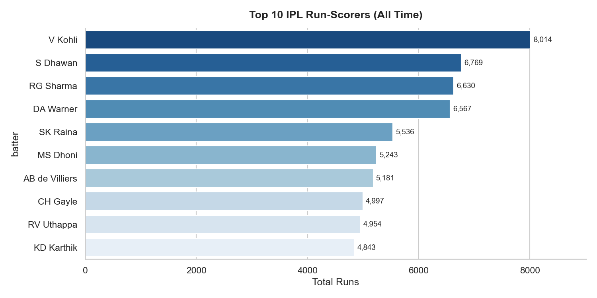
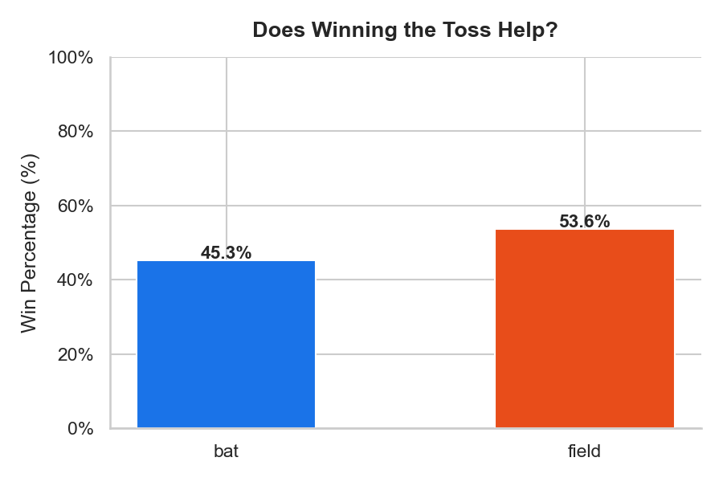
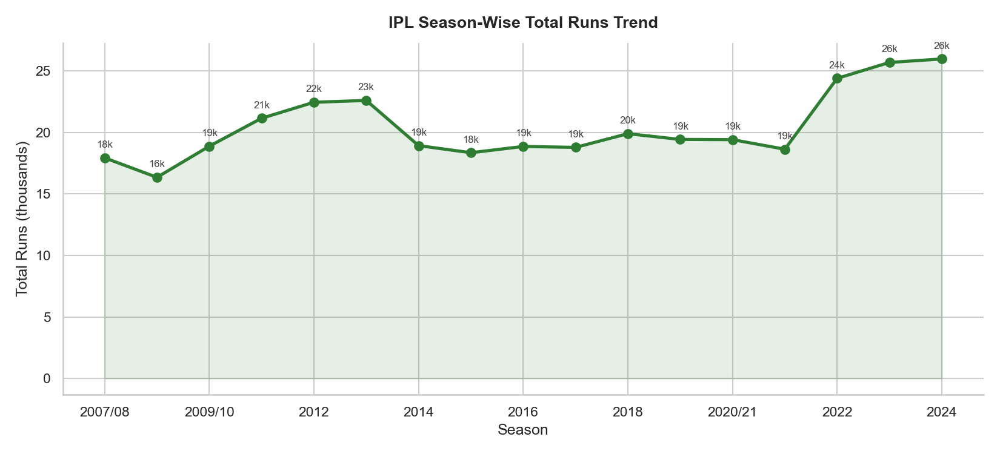

# 🏏 IPL Cricket Performance Analytics

> **A beginner-friendly Data Analytics portfolio project** exploring 16 seasons of IPL data using Python, SQL, Excel, and Power BI.


---

## 📌 Project Overview

This project performs **end-to-end data analysis on IPL (Indian Premier League) cricket data** from 2008 to 2023.  
It answers real business-style questions a sports analytics team would care about:

| # | Business Question | Tool Used |
|---|---|---|
| 1 | Which teams win the most matches? | Python + SQL |
| 2 | Who are the top run-scorers all time? | Python + SQL |
| 3 | Who takes the most wickets? | Python + SQL |
| 4 | Does winning the toss actually help? | Python + SQL |
| 5 | How have run rates trended across seasons? | Python + Power BI |
| 6 | Head-to-head team records | SQL |
| 7 | Best economy rates among bowlers | SQL |

---

## 🗂️ Project Structure

```
ipl-analytics/
│
├── data/                        ← Place your CSV files here (not committed)
│   ├── matches.csv
│   └── deliveries.csv
│
├── sql/
│   └── ipl_queries.sql          ← 10 SQL queries (SQLite / PostgreSQL)
│
├── visualizations/              ← Auto-generated charts from ipl_analysis.py
│   ├── 01_team_wins.png
│   ├── 02_top_batters.png
│   ├── 03_top_bowlers.png
│   ├── 04_toss_impact.png
│   └── 05_season_runs.png
│
├── ipl_analysis.py              ← Main Python analysis script
├── requirements.txt
├── .gitignore
└── README.md
```

---

## 📊 Key Insights

### 1. Team Win Leaderboard
Mumbai Indians lead the all-time win count, followed by Chennai Super Kings — consistent powerhouses across all 16 seasons.

### 2. Top Batters
Virat Kohli holds the record for most IPL runs. The top 10 batters all have **strike rates above 130**, reflecting the T20 format's aggressive nature.

### 3. Bowling Economy
Spinners dominate the economy-rate charts in powerplay and middle overs, with economy rates under 7.0 being elite in T20 cricket.

### 4. Toss Impact
Teams that win the toss and **choose to field** win ~53% of matches — a slight but consistent edge over batting first, especially in evening dew conditions.

### 5. Season Run Trends
Total runs per season have grown by ~18% from 2008 to 2023, driven by more matches (from 58 to 74) and increased batting aggression in the death overs.

---

## 🛠️ Tools & Technologies

| Tool | Purpose |
|---|---|
| **Python 3.10+** | Data cleaning, analysis, visualization |
| **Pandas** | Data manipulation and aggregation |
| **Matplotlib / Seaborn** | Statistical charts and graphs |
| **SQL (SQLite)** | Querying structured data, window functions |
| **Excel** | Pivot tables, basic EDA, data exploration |
| **Power BI** | Interactive dashboard for stakeholder view |

---

## 🚀 How to Run

### Step 1 — Get the Dataset
Download from Kaggle: [IPL Complete Dataset 2008–2020](https://www.kaggle.com/datasets/patrickb1912/ipl-complete-dataset-20082020)  
Place `matches.csv` and `deliveries.csv` inside the `data/` folder.

### Step 2 — Install Dependencies
```bash
pip install -r requirements.txt
```

### Step 3 — Run the Analysis
```bash
python ipl_analysis.py
```
Charts will be saved in the `visualizations/` folder.

### Step 4 — Run SQL Queries
Open `sql/ipl_queries.sql` in:
- **DB Browser for SQLite** (free desktop app), or
- Any SQL client connected to PostgreSQL / MySQL

### Step 5 — Power BI Dashboard
- Open `dashboard/IPL_Dashboard.pbix` in Power BI Desktop
- Refresh data source pointing to your `data/` folder

---

## 📈 Sample Charts

| Team Wins | Top Batters |
|---|---|
|  |  |

| Toss Impact | Season Runs |
|---|---|
|  |  |

---

## 💡 Skills Demonstrated

- ✅ Data loading & cleaning with Pandas
- ✅ Exploratory Data Analysis (EDA)
- ✅ Aggregations, groupby, merge operations
- ✅ SQL window functions (RANK, PARTITION BY)
- ✅ Data visualization best practices
- ✅ Storytelling with data (insights, not just charts)
- ✅ Project documentation and GitHub workflow

---

## 📚 Dataset

- **Source**: [Kaggle — IPL Complete Dataset](https://www.kaggle.com/datasets/patrickb1912/ipl-complete-dataset-20082020)
- **Records**: ~900 matches | ~800,000 deliveries
- **Seasons**: 2008–2023

---

## 👤 Author

**[Your Name]**  
Aspiring Data Analyst | Python · SQL · Power BI  
📧 your.email@gmail.com  
🔗 [LinkedIn](https://linkedin.com/in/yourprofile) | [GitHub](https://github.com/yourgithub)

---

## 📝 License

This project is open-source under the [MIT License](LICENSE).
